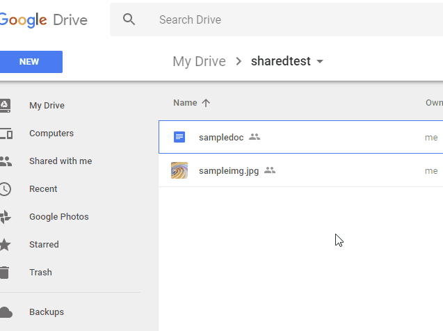
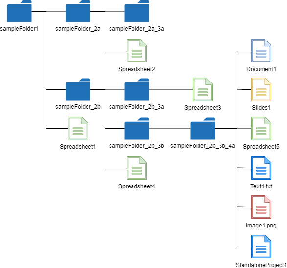

goodls
=====

# Overview
This is a CLI tool to download shared files from Google Drive. From version 1.1.0, this CLI tool got to be able to download files with the folder structure from the shared folder in Google Drive.

# Demo

The image used for this demonstration was created by [k3-studio](https://k3-studio.deviantart.com/art/Chromatic-spiral-416032436)

# Description
We have already known that the shared files on Google Drive can be downloaded without the authorization. But when the size of file becomes large (about 40MB), it requires a little ingenuity to download the file. It requires to access 2 times to Google Drive. At 1st access, it retrieves a cookie and a code for downloading. At 2nd access, the file is downloaded using the cookie and code. I created this process as a CLI tool. This tool has the following features.

- Use suitable process for size and type of file.
- Retrieve filename and mimetype from response header.
- Can download all shared files except for project files.

# How to Install
Download an executable file of goodls from [the release page](https://github.com/tanaikech/goodls/releases) and import to a directory with path.

or

Use go get.

~~~bash
$ go get -u github.com/tanaikech/goodls
~~~

# Usage
You can use this just after you download or install goodls. You are not required to do like OAuth2 process.

~~~bash
$ goodls -u [URL of shared file on Google Drive]
~~~

- **Help**
    - ``$ goodls --help``
- **Options**
    - ``-e``
        - Extension of output file. This is for only Google Docs (Spreadsheet, Document, Presentation). Default is ``pdf``.
        - Sample :
            - ``$ goodls -u https://docs.google.com/document/d/#####/edit?usp=sharing -e txt``
    - ``-f``
        - Filename of file which is output. When this was not used, the original filename on Google Drive is used.
        - Sample :
            - ``$ goodls -u https://docs.google.com/document/d/#####/edit?usp=sharing -e txt -f sample.txt``
- **URL is like below.**
    - In the case of Google Docs (Spreadsheet, Document, Slides)
        - ``https://docs.google.com/spreadsheets/d/#####/edit?usp=sharing``
        - ``https://docs.google.com/document/d/#####/edit?usp=sharing``
        - ``https://docs.google.com/presentation/d/#####/edit?usp=sharing``
    - In the case of except for Google Docs
        - ``https://drive.google.com/file/d/#####/view?usp=sharing``

## File with URLs
If you have a file including URLs, you can input the URL data using standard input and pipe as follows. If wrong URL is included, the URL is skipped.

~~~bash
$ cat sample.txt | goodls
~~~

or

~~~bash
$ goodls < sample.txt
~~~

**sample.txt**

~~~
https://docs.google.com/spreadsheets/d/#####/edit?usp=sharing
https://docs.google.com/document/d/#####/edit?usp=sharing
https://docs.google.com/presentation/d/#####/edit?usp=sharing
~~~

**When you download shared files from Google Drive, please confirm whether the files are shared.**

## Download all files from shared folder

When above structure is downloaded, the command is like below. At that time, the folder ID is the folder ID of "sampleFolder1".

Files are downloaded from the shared folder. In this demonstration, the fake folder ID and API key are used.

### Retrieve API key
In order to use this, please retrieve API key as the following flow.

1. Login to Google.
2. Access to [https://console.cloud.google.com/?hl=en](https://console.cloud.google.com/?hl=en).
3. Click select project at the right side of "Google Cloud Platform" of upper left of window.
4. Click "NEW PROJECT"
    1. Input "Project Name".
    2. Click "CREATE".
    3. Open the created project.
    4. Click "Enable APIs and get credentials like keys".
    5. Click "Library" at left side.
    6. Input "Drive API" in "Search for APIs & Services".
    7. Click "Google Drive API".
    8. Click "ENABLE".
    9. Back to [https://console.cloud.google.com/?hl=en](https://console.cloud.google.com/?hl=en).
    10. Click "Enable APIs and get credentials like keys".
    11. Click "Credentials" at left side.
    12. Click "Create credentials" and select API key.
    13. Copy the API key. You can use this API key.

### Download
When the URL of shared folder is ``https://drive.google.com/drive/folders/#####?usp=sharing``, you can download all files in the folder by the following command.

~~~bash
$ goodls -u https://drive.google.com/drive/folders/#####?usp=sharing -key [APIkey]
~~~

- Project files cannot be downloaded by API key. If you want to download the project files, you can download them by [ggsrun](), because ggsrun uses OAuth2.
- This new function uses the Go library of [go-getfilelist](https://github.com/tanaikech/go-getfilelist).
- When the option of ``--NoProgres``, ``-np`` is used, the progress information is not seen. This is a silent mode.
- If the files which are tried to be downloaded are existing, an error occurs. But when you use the option ``--overwrite`` and ``--skip``, the files are overwritten and skipped, respectively.

### Retrieve information of file and folder
When you want to retrieve the information of file and folder, you can do it as follows.

#### For file
~~~bash
$ goodls -u https://docs.google.com/spreadsheets/d/#####/edit?usp=sharing -key [APIkey] -i
~~~

#### For folder
~~~bash
$ goodls -u https://drive.google.com/drive/folders/#####?usp=sharing -key [APIkey] -i
~~~

# Q&A
- I want to download **shared projects** from user's Google Drive.
    - You can download **shared projects** using [ggsrun](https://github.com/tanaikech/ggsrun).
    - ggsrun can also download **shared files** from other user's Google Drive using Drive API which needs the access token.
- I want to download all files including the standalone projects from the shared folder and own folder.
    - You can achieve it using [ggsrun](https://github.com/tanaikech/ggsrun).

-----

# Licence
[MIT](LICENCE)

# Author
[Tanaike](https://tanaikech.github.io/about/)

If you have any questions and commissions for me, feel free to tell me.

# Update History
* v1.0.0 (January 10, 2018)

    1. Initial release.

* v1.0.1 (January 11, 2018)

    1. In order to download several files, a datafile including URLs using Standard Input and Pipe have gotten to be able to be inputted.

* v1.0.2 (May 10, 2018)

    1. Files with large size has gotten to be able to be used.
        - In order to download files with large size (several gigabytes), files are saved by chunks.

* v1.0.3 (September 4, 2018)

    1. When the files are downloaded, the progress of downloading got to be able to be displayed.
        - This demonstration can be seen at [Demo](#demo2).
        - If the new option of ``--np`` is used, the progress is not displayed.

* v1.1.0 (November 4, 2018)

    1. By using API key, files from **the shared folder** got to be able to be downloaded while keeping the folder structure.
        - This demonstration can be seen at [Demo](#demo3).
    1. By using API key, the information of shared file and folder can be also retrieved.
    1. About the option of ``--extension`` and ``-e``, when ``-e ms`` is used, Google Docs (Document, Spreadsheet, Slides) are converted to Microsoft Docs (Word, Excel, Powerpoint), respectively.

[TOP](#TOP)
